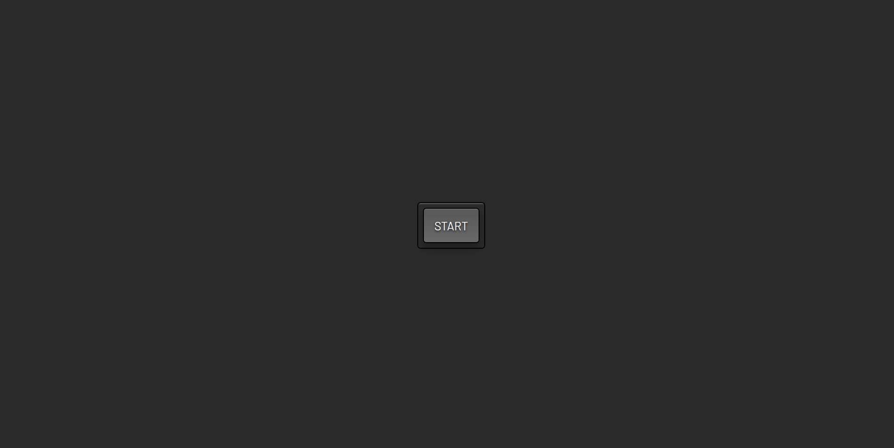

<div align="center">

# 🖼️ Picture in Picture

   

A simple web app to explore the Picture-in-Picture API — share your screen in a floating miniature window with a single click.

</div>

## 📖 About

This project was built purely for learning purposes, as a hands-on exploration of the **Picture-in-Picture API** and the **Screen Capture API** (`getDisplayMedia`). The idea is straightforward: click a button, choose a screen or window to share, and watch it appear as a floating mini-player that stays on top of everything else.

## ✨ Features

- One-click screen capture via `navigator.mediaDevices.getDisplayMedia()`
- Floating Picture-in-Picture window using the native browser PiP API
- Automatically detects if a stream is already active before starting a new one
- Handles stream termination gracefully — both via the app button and the browser's native stop button
- Minimal and clean interface — no distractions, just the feature

## 🎬 Demo



⛓️‍💥 [Live demo](https://pmbfsa.github.io/picture-in-picture)

## 🚀 Getting Started

### Prerequisites

- [Node.js](https://nodejs.org/) (v18 or higher recommended)
- npm (comes with Node.js)

### Installation

```bash
# Clone the repository
git clone https://github.com/seu-usuario/picture-in-picture.git

# Navigate into the project directory
cd picture-in-picture

# Install dependencies
npm install

# Start the development server
npm run dev
```

Open your browser and go to `http://localhost:5173`.

### Build for production

```bash
npm run build
```

The output will be placed in the `docs/` folder, ready for GitHub Pages deployment.

## 🛠️ Built With

| Technology                                | Description                                  |
| ----------------------------------------- | -------------------------------------------- |
| HTML5                                     | Page structure and semantic markup           |
| CSS3                                      | Styling and layout                           |
| JavaScript (Vanilla)                      | Screen capture logic and PiP API integration |
| [Vite](https://vitejs.dev/)               | Build tool and development server            |
| [GitHub Pages](https://pages.github.com/) | Static site hosting and deployment           |

## 📁 Project Structure

```
picture-in-picture/
├── docs/               # Production build output (GitHub Pages deploy)
├── public/
│   └── favicon.png     # Site favicon
├── src/
│   ├── styles/
│   │   └── style.css   # Application styles
│   └── main.js         # Screen capture and PiP logic
├── package.json        # Project metadata and scripts
└── vite.config.js      # Vite configuration
```

## 📄 License

This project is licensed under the **GNU General Public License v3.0**. See the [LICENSE](LICENSE) file for details.
